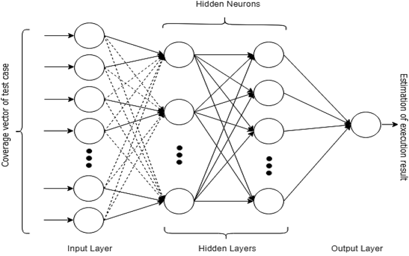
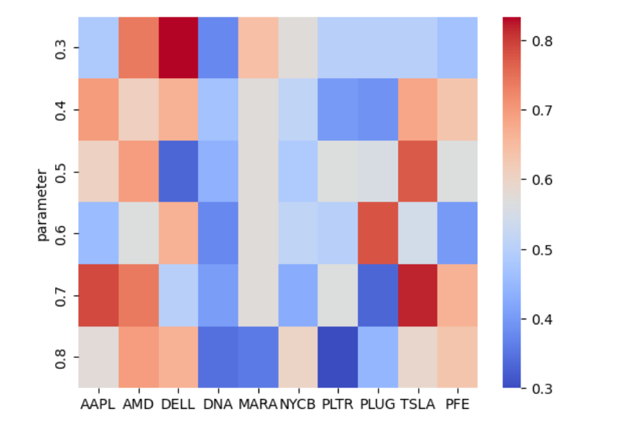
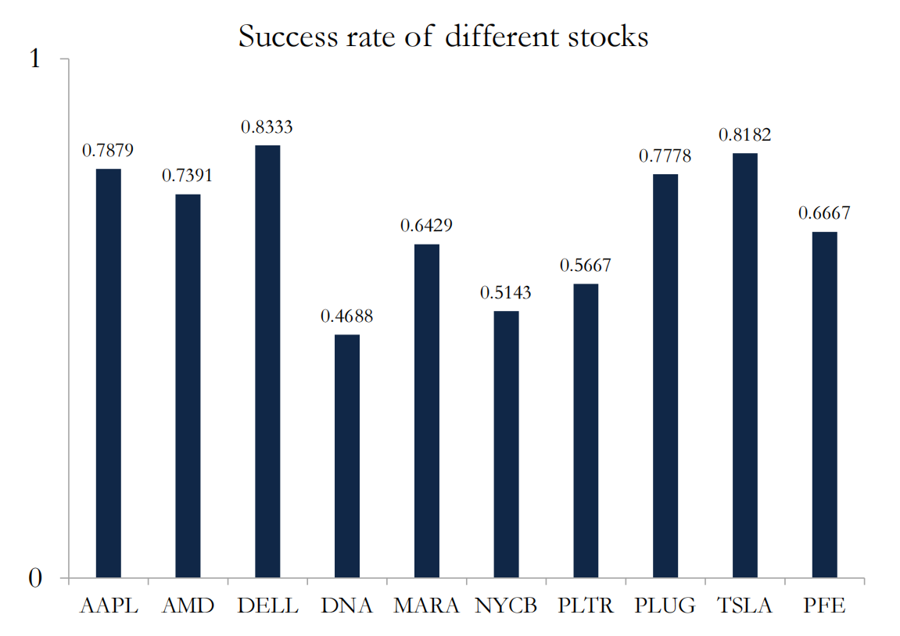

By Group "Coding Master"

In this blog, we aim to forecast the trend of volatility based on comments on Yahoo Finance. This blog is mainly about how we process sentiment scores and how we fit our model to derive the optimal model with higher predicted accuracy. 

## Import libraries

```python
import pandas as pd
import numpy as np
import math
import warnings
from sklearn.model_selection import train_test_split
from keras import Sequential
from keras.layers import Dense, Dropout
```
## Calculate volatility trend index

In this step, we create a dataframe called 'label' to store volatility trend index, the columns is stock ticket and the index is date. Here we make a definition:    

Volatility Trend Index = 1 if $\frac{Chg_{T}}{Chg_{T-1}} \geq 1$ otherwise = 0, $Chg_{T}$ refers to the price change at time T.

```python
#create DataFrame to save sample labels for every stock in every day
labels=pd.DataFrame(columns=['time']+stock_sequence)
data=[]
#date_index to save sample dates for every day
date_index=[]
for i in range(len(stock_sequence)):
    data.append(pd.read_excel(stock_sequence[i]+".xlsx"))
    for j in data[i]['日期']:
        if j not in date_index:
            date_index.append(j)
for k in range(4):
    del date_index[-1]

for i in range(len(date_index)):
    popin=[date_index[i]]
    for j in range(len(stock_sequence)):
        if abs(data[j]['涨跌幅'][i+1])/abs(data[j]['涨跌幅'][i])>=1:
            popin.append(1)
        else:
            popin.append(0)


    labels.loc[labels.shape[0]]=popin
```

## Load sentiment scores

In this step, we create a dataframe of list called 'sample', the columns is stock ticket and the indexe is date. Each list of a stock in each day contains sentiment scores of all comments that day related.    

However, there are a few comments that were made on weekends or holidays. Because the market is closed and we can't get stock data on these days, it seems that these comments is useless. Here We do some basic process: for the comments posted on weekends or holidays, we set the date of these comments as the next workday. 


```python
#create DataFrame to save sample scores for every stock in every day
#use samples[stock][date][i] to get the ith comment score
samples=pd.DataFrame(columns=['time']+stock_sequence)
for j in date_index:
    popin=[j]
    for i in stock_sequence:
        popin.append([])
    samples.loc[samples.shape[0]]=popin
#set date as index
samples.set_index('time',inplace=True)

for i in range(len(stock_sequence)):
    score=pd.read_excel(stock_sequence[i]+"_scored.xlsx")
    #Change the date of the comments to workdays.
    for j in range(score.shape[0]):
        if score['date'][j] not in date_index and score['date'][j]>date_index[0] and score['date'][j]<date_index[-1]:
            for kk in date_index:
                if kk-score['date'][j]>kk-kk:
                    score['date'][j]=kk
                    break

    for j in range(score.shape[0]):
        if score['date'][j] in date_index:
            samples[stock_sequence[i]][score['date'][j]].append(score['polarity'][j])
```
        


## Calculate emotion index

As our goal is to predict the trend of volatility, it is better to mainly focus on how intense people feel about the stock instead of how positive people's comments are.

The main function of this code is to calculate the emotion index according to the different intense comment criteria. As the criteria for minimum standard of intense sentiment score is hard to decide casually, we first define a set of possible strong comment criteria (prop) and find the best one through training results. Under each criterion, we traverse the date and calculate the emotion index based on the sentiment score. **We define the emotion index as the ratio of the number of intense comments to the total number of comments on each date.**

It is worth noting that we also handles some exceptions, such as setting the emotion index to 0.1 when it is 0 to avoid potential errors.

```python
#prop saves some criteria for intense comments
prop=[0.3,0.4,0.5,0.6,0.7,0.8]
for stock in stock_sequence:
    for propp in prop:
        x=[]
        y=[]
        #making samples for every possible criteria
        for i in date_index[1:-1]:
            get_index=date_index.index(i)
            if samples[stock][i]!=[] and samples[stock][date_index[get_index-1]]!=[]:
                xi=0
                xi1=0
                for kk in samples[stock][i]:
                    if abs(kk)>propp:
                        xi+=1
                for kk in samples[stock][date_index[get_index-1]]:
                    if abs(kk)>propp:
                        xi1+=1
                ei=xi/len(samples[stock][i])
                ei1=xi1/len(samples[stock][date_index[get_index-1]])
                if ei1==0:
                    ei1=0.1

                x.append([ei/ei1,1/abs(data[stock_sequence.index(stock)]['涨跌幅'][date_index[get_index-1]])*abs(data[stock_sequence.index(stock)]['涨跌幅'][i])])
                y.append(labels[stock][i])
```

## About BP neural network

The back propagation (BP) neural network algorithm is a multi-layer feedforward network trained according to error back propagation algorithm and is one of the most widely applied neural network models. BP network can be used to learn and store a great deal of mapping relations of input-output model, and no need to disclose in advance the mathematical equation that describes these mapping relations. Its learning rule is to adopt the steepest descent method in which the back propagation is used to regulate the weight value and threshold value of the network to achieve the minimum error sum of square. 



The BP learning process can be described as follows:

### Forward propagation of operating signal
The input signal is propagated from the input layer, via the hide layer, to the output layer. During the forward propagation of operating signal, the weight value and offset value of the network are maintained constant and the status of each layer of neuron will only exert an effect on that of next layer of neuron. In case that the expected output can not be achieved in the output layer, it can be switched into the back propagation of error signal. 

### Back propagation of error signal
The difference between the real output and expect output of the network is defined as the error signal; in the back propagation of error signal, the error signal is propagated from the output end to the input layer in a layer-by-layer manner. During the back propagation of error signal, the weight value of network is regulated by the error feedback. The continuous modification of weight value and offset value is applied to make the real output of network more closer to the expected one.

## Model training

we use the basic BP neural network model to train and predict the trend of volatility and calculate the prediction accuracy. we first split the data set into a training set and a test set, randomly choosing 20% of the total data as testing sample. Next, we construct the neural network with 5 layers in total. These layers are configured to build a neural network structure with 2-128-256-256-128-1. The model uses MSE as a loss function, adam as an optimizer, and accuracy as an evaluation index. We use previous day's emotion index and volatility as inputs, and use the volatility trend index as output. After the training is complete, we use the test set to evaluate its effectiveness and record the prediction accuracy.   

Besides from adding Dense layer, we add Dropout layers after each Dense layer to randomly drop a portion of neurons to prevent overfitting.

```python
train_x, test_x, train_y, test_y = train_test_split(x, y, test_size=0.2)
model = Sequential()
model.add(Dense(128,activation='relu',input_shape=(2,)))
model.add(Dropout(0.3))
model.add(Dense(256,activation='relu'))
model.add(Dropout(0.3))
model.add(Dense(256,activation='relu'))
model.add(Dropout(0.3))
model.add(Dense(128,activation='relu'))
model.add(Dropout(0.3))
model.add(Dense(1))
model.compile(loss='mse', optimizer='adam',metrics=['accuracy'])
history = model.fit(train_x, train_y, epochs=200, batch_size=20,validation_data=(test_x, test_y),shuffle=True, verbose=0)
score = model.predict(test_x)
sum11 = 0
for kkk in range(len(score)):
    if score[kkk]>=0.5:
       flag=1
    else:
       flag=0
    if flag==test_y[kkk]:
       sum11+=1
print(propp,stock,str(sum11/len(score)*100)+'%')

save_final.loc[len(save_final)]=[propp,stock,sum11/len(score)]
```

The prediction accuracy under different intense comments criterion is shown below:   



We choose the optimal model of different stocks and the prediction accuracy is shown below:    


We can see that the performance of the model changes greatly among different stocks.

## Conclusion
In summary, the model is only suitable for some stocks and there are still a lot we can do to further improve our model. It is necessary to test its effectiveness before using it for a particular stock. 

